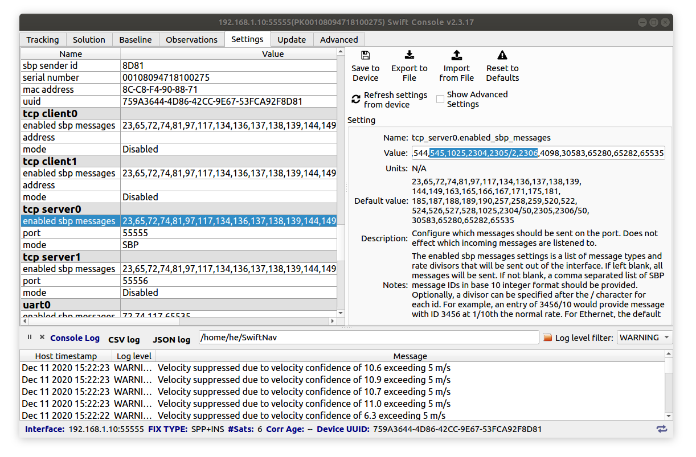
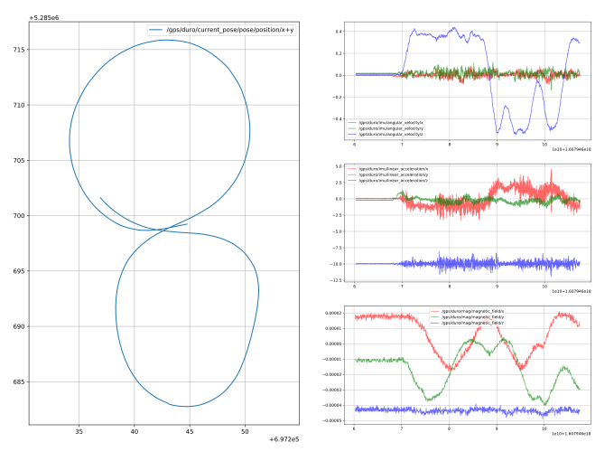

# Duro Inertial GPS `ROS`/`ROS2` Driver

## Contents

- [Duro Inertial GPS `ROS`/`ROS2` Driver](#duro-inertial-gps-rosros2-driver)
  - [Contents](#contents)
  - [Overview](#overview)
  - [Scope](#scope)
  - [Install](#install)
    - [1. step](#1-step)
    - [2. step](#2-step)
      - [`ROS` install](#ros-install)
      - [`ROS2` install](#ros2-install)
  - [Settings](#settings)
  - [Run](#run)
  - [Topics](#topics)
  - [Example rosbag](#example-rosbag)
  - [Further reading](#further-reading)
## Overview

This is a C++ ROS driver for Swiftnaw Duro Inertial (Piksi Multi Inertial) GPS / GNSS Receivers. The code is based on offical Swiftnav libswiftnav C example and <del>Alex Hajnal's</del> Apollo UTM converter code. **Note** that orientation data is produced by Duro Inertial but not produced by Piksi Multi or Duro.

## Scope
The current version supports *only* (not tested elsewhere):
- Ubuntu 18.04 (Ubuntu 22.04 ROS2)
- ROS Melodic (ROS2 Humble)
- Catkin tools https://catkin-tools.readthedocs.io/ (Colcon) 
- Only ethernet version (no serial or USB support)

## Install
### 1. step
Install libsbp (Swift binary protocol library) C client library from GitHub: https://github.com/swift-nav/libsbp
It is detailed in github, but the main steps are:
``` r
sudo apt-get install build-essential pkg-config cmake doxygen check
cd ~; mkdir git; cd git     # eg create a git folder, the folder name can be different
git clone https://github.com/swift-nav/libsbp.git
cd libsbp
git checkout e149901e63ddcdb0d818adcd8f8e4dbd0e2738d6 # TODO: https://github.com/szenergy/duro_gps_driver/issues/33
cd c
git submodule update --init --recursive
mkdir build; cd build
cmake ../
make
sudo make install
```
This will create some files in `/usr/local/include/libsbp/` and in `/usr/local/lib`.

### 2. step
#### `ROS` install
Clone the duro_gps_driver package into your Catkin workspace. 
Navigate to the root of your Catkin workspace. Source your setup.bash file. Build the `duro_ros` package using Catkin:
```bash
git clone https://github.com/szenergy/duro_gps_driver
catkin build duro_ros
source devel/setup.bash
```

#### `ROS2` install
Navigate to the root of your Colcon workspace. Source your setup.bash file. Build the `duro_ros` package using Colcon:
``` bash
cd ~/ros2_ws/src
git clone https://github.com/szenergy/duro_gps_driver
git checkout ros2-humble
cd ..
colcon build --packages-select duro_gps_driver
source ~/ros2_ws/install/local_setup.bash && source ~/ros2_ws/install/setup.bash
```

## Settings 
Enable MSG ID 544 and 545 in swift console. Once again, orientation data not produced by Piksi Multi or Duro. These orientation messages are not enabled in default configuration.
The MSG ID is defined in the headers, e.g. `#define SBP_MSG_ORIENT_QUAT 0x0220` which is decimal `544`.
Also by defult the magnetometer publishes every 50th message. Change `2306/50` to `2306` in swift console (this message in hex is `0x0902`).



## Run
Make sure that `roscore` is running. 
The `duro-gps` driver can be run using the `rosrun` command. It is necessary to provide your device's IP address and port number. 
E.g:
```
ros2 run duro_ros duro_node --ros-args -p ip_address:="192.168.1.10" -p port:=55555
rosrun duro_ros duronode _ip_address:=192.168.1.10 _port:=55555
```
Alternatively you can use a [launch](launch/duro_example.launch.py) file. E.g:
```
ros2 launch duro_gps_driver duro_example.launch.py
ros2 launch duro_gps_driver duro_example.launch.xml
roslaunch duro_ros duro_example.launch
```

## Topics
`duro_ros duronode` publishes the following topics and [types]:
|Topic|Type
|-|-|
`/gps/duro/current_pose` |[`[geometry_msgs/PoseStamped]`](http://docs.ros.org/en/melodic/api/geometry_msgs/html/msg/PoseStamped.html)
`/gps/duro/fix` |[`[sensor_msgs/NavSatFix]`](http://docs.ros.org/en/melodic/api/sensor_msgs/html/msg/NavSatFix.html)
`/gps/duro/imu` |[`[sensor_msgs/Imu]`](http://docs.ros.org/en/melodic/api/sensor_msgs/html/msg/Imu.html)
`/gps/duro/mag` |[`[sensor_msgs/MagneticField]`](http://docs.ros.org/en/melodic/api/sensor_msgs/html/msg/MagneticField.html)
`/gps/duro/odom ` |[`[nav_msgs/Odometry]`](http://docs.ros.org/en/melodic/api/nav_msgs/html/msg/Odometry.html)
`/gps/duro/rollpitchyaw` |[`[geometry_msgs/Vector3]`](http://docs.ros.org/en/melodic/api/geometry_msgs/html/msg/Vector3.html)
`/gps/duro/status_flag` |[`[std_msgs/UInt8]`](http://docs.ros.org/en/melodic/api/std_msgs/html/msg/UInt8.html)
`/gps/duro/status_string` |[`[std_msgs/String]`](http://docs.ros.org/en/melodic/api/std_msgs/html/msg/String.html)
`/gps/duro/time_ref` |[`[sensor_msgs/TimeReference]`](http://docs.ros.org/en/api/sensor_msgs/html/msg/TimeReference.html)


An important topic is `/gps/duro/current_pose` which is `geometry_msgs/PoseStamped` type in UTM (https://en.wikipedia.org/wiki/Universal_Transverse_Mercator_coordinate_system) eg:

``` c
header: 
  seq: 5545
  stamp: 
    secs: 1580388036
    nsecs: 641742448
  frame_id: 'map'
pose: 
  position: 
    x: 697214.762607
    y: 5285721.97968
    z: 0.0
  orientation: 
    x: 0.00819693645462
    y: 0.00343747669831
    z: 0.692575566471
    w: 0.721290563233

```

## Example rosbag
Download a sample rosbag, and also a small script to plot the data [here](https://nbviewer.jupyter.org/github/szenergy/szenergy-utility-programs/blob/master/bag_scripts/plotgpsandimu.ipynb) or alteratively [here](https://github.com/szenergy/szenergy-utility-programs/blob/master/bag_scripts/plotgpsandimu.ipynb).



## Further reading
- Libswiftav: https://github.com/swift-nav/libswiftnav
- Libsbp documentation: https://swift-nav.github.io/libsbp/c/build/docs/html
- Libsbp 2.8.0: [Protocol specification pdf](https://www.swiftnav.com/resource-files/Swift%20Navigation%20Binary%20Protocol/v2.8.0/Specification/Swift%20Navigation%20Binary%20Protocol%20Specification%20v2.8.0.pdf)
- ETH python Piksi ROS drivers: https://github.com/ethz-asl/ethz_piksi_ros
